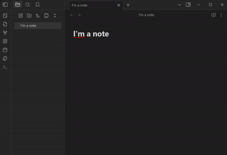
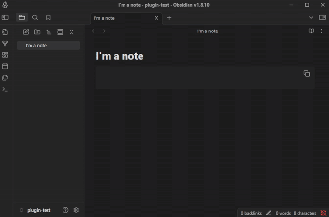

<div align="center">
  <h1>JuliaPlots</h1>

     <a href="https://obsidian.md/"></a>  <a href="https://ko-fi.com/abbonexcore"></a>
  <p>Generate Julia function plots in Obsidian easily!</p>

</div>


## 🌟 Features
- Easily generate graphs of 2D and 3D functions **directly in Obsidian** using Julia
- **Straightforward** and fast syntax
- Customizable **default parameters**
- **Graph customization** (Colors, line width, title, labels, dark mode)
- Multiple functions rendering support
- 2D Points rendering support

## 📋 Demo




## 🖥️ Installation
> ⚠️ This plugin only works for the **desktop** Obsidian app

1. Install [Julia](https://julialang.org/) on your system, and install the [Plots](https://docs.juliaplots.org/stable/) package in it.

2. Download the plugin from Settings > Community plugins > Browse and enable it

3. Download [juliaplots.jl](https://github.com/ivnmansi/juliaplots/releases) from the latest release and put the file in `.obsidian/plugins/juliaplots/` on your vault


## ⚡ Usage

| Parameter      | Description                                                           |
|----------------|-----------------------------------------------------------------------------------------------------------------------------------------------------|
| `<name_of_function>(x)=<math_equation>, <color>`| **Function to plot** in terms of `x`. It can have any name, as long as it ends with `(x)`. Color can be omitted. You can add as many as you want. |
| `<name_of_function>(x,y)=<math_equation>, <color>`| **3D Function to plot** in terms of `x` and `y`. It can have any name, as long as it ends with `(x,y)`. Color can be omitted. You can add as many as you want. |
| `scatter=<x>,<y>,<color>,<label> ; <x2>,<y2>...`| **Points to render on the graph**. Multiple points must be separated with a `;`. Color and label can be omitted, but if not, they have to be in the **specified order** |
| `xmin=<number>`| **Start of the range** on the x-axis that will be plotted |
| `xmax=<number>`| **End of the range** on the x-axis that will be plotted |
| `ymin=<number>`| **Start of the range** on the y-axis that will be plotted (for 3D functions) |
| `ymax=<number>`| **End of the range** on the y-axis that will be plotted (for 3D functions) |
| `num_points=<number>`| Number of points of the function that will be plotted on the range (*warning: a small number will result in a non-smooth graph*) |
| `title=<graph_title>`| **Title** that will be displayed at the top of the graph |
| `x_label=<label>`| **Label** that will be displayed on the **x-axis** |
| `y_label=<label>`| **Label** that will be displayed on the **y-axis** |
| `z_label=<label>`| **Label** that will be displayed on the **z-axis** (for 3D functions) |
| `color=<color>`| **Color** that the **functions** on the graph will use if not specified |
| `scatter_color=<color>`| **Color** that the **points** on the graph will use if not specified |
| `line_width=<number>`| Width of the function lines |
| `dark_mode=<true/false>` | Renders the graph with a suitable view for vaults with dark themes |

> ☑️ If any of these parameters is omitted, the configured default value will be used! You can change them in the plugin's settings tab

### Example

<pre>
   ```juliaplots
   f(x) = x^2, red
   myfunction2(x) = cos(x)
   scatter= 2,1 ; 3,2,red,point1

   xmin = -10
   xmax = 25
   num_points = 100

   title = my graph
   x_label = time (s)
   y_label = velocity (m/s)

   color = rgb(0,255,0)
   scatter_color = black
   line_width = 2
   dark_mode = false
   ```</pre>


## ❗ Known issues
- 🕒 **Long waiting time:** The plugin can take a long time to generate the graph depending on the user. If you have this problem, it is recommended to use a lower number of plot points.


## 🤝 Contributing
Feel free to open an issue or a pull request if you have suggestions, improvements, or bug reports. This plugin is in a very early development stage; every contribution is appreciated.
