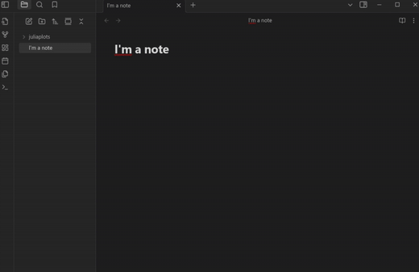

<center>
  <h1>JuliaPlots</h1>

    
  <p>Generate Julia plots function graphs in Obsidian easily!</p>

</center>


## 🌟 Features
- Easily generate function plots **directly in Obsidian** using Julia, without having to use the language sintax
- Fast and straightforward setup
- Customizable default parameters


## 📋 Demo



## 🖥️ Installation
> ⚠️ This plugin just works for the **desktop** Obsidian app

1. Install [Julia](https://julialang.org/) into your system, and install the [Plots](https://docs.juliaplots.org/stable/) package on it.

2. Download `main.js`, `juliaplots.jl` and `manifest.json` from the [latest release](https://github.com/ivnmansi/juliaplots/releases).

3. Place those files in your Obsidian plugins folder:

   ```
   .obsidian/plugins/juliaplots
   ```

4. Reload or restart Obsidian and enable the plugin in Settings → Community plugins.

## ⚡ Usage
   <pre>
   ```juliaplots
   function=cos(x)+1
   xmin=-10
   xmax=25
   num_points=100
   ```
   </pre>

   - `function`: Function wanted to plot
   - `xmin`: Start of the x range that will be plotted
   - `xmax`: End of the x range that will be plotted
   - `num_points`: Number of points of the function that will be plotted on the range (*warning: a small number will result in a non-smooth graph*)

## ❗ Known issues and posible future features
- 🕒 **Long waiting time:** The plugin takes approximately 10 seconds to generate and insert a graph.
- 📈 **Graph customization:** Graphs cannot have custom titles and other graph customizations that Julia plots allow. **


## 🤝 Contributing
Feel free to open an issue or a pull request if you have suggestions, improvements, or bug reports. This plugin is in a very early development stage, every contribution is apreciated.